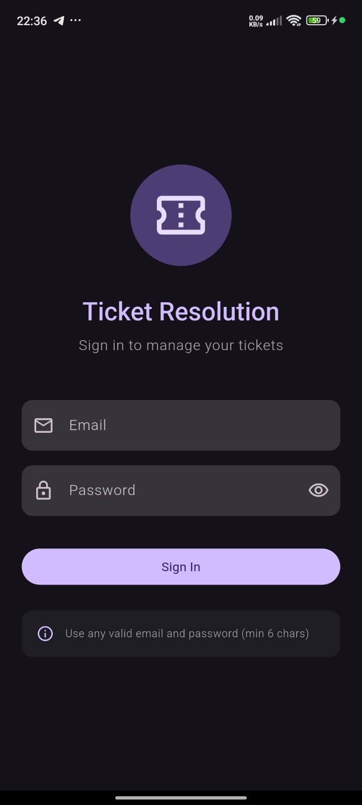
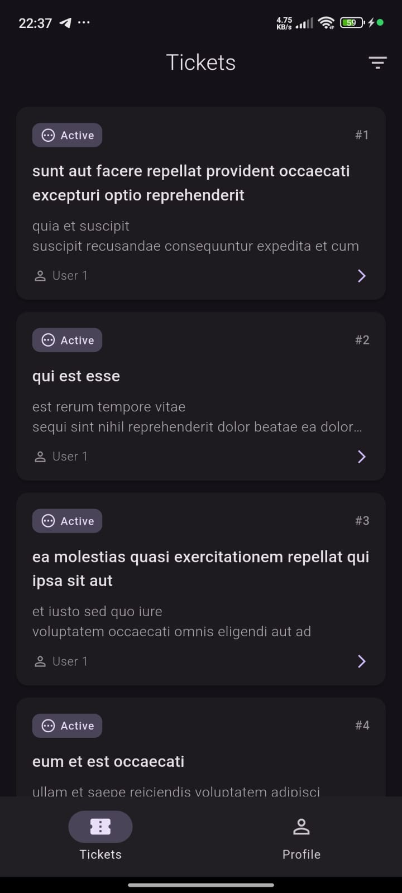
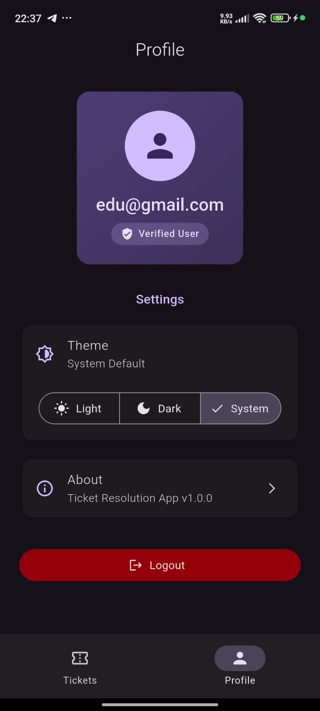

# Ticket Resolution App

A Flutter application for managing and resolving support tickets with a clean, modern interface built with Material Design 3.

## 📱 Screenshots

### Login Screen



### Tickets List



### Ticket Detail


### Profile



## 📥 Download

Download the latest APK: [ticket_app.apk](assets/ticket_app.apk)

## 📱 Features Implemented

### ✅ Mandatory Requirements

1. **Authentication System**

   - Mock login with email and password validation
   - Form validation (email pattern matching, minimum password length)
   - Persistent login state using local storage
   - Automatic authentication redirect

2. **Tickets Management**

   - Fetch tickets from JSONPlaceholder API
   - Display tickets in an elegant card-based list
   - Real-time filtering (All, Active, Resolved)
   - Pull-to-refresh functionality
   - Persistent resolved state

3. **Ticket Details**

   - Full ticket information display
   - "Mark as Resolved" functionality
   - Resolved state persisted locally
   - Visual indicators for ticket status
   - Confirmation dialog for actions

4. **Bottom Navigation**

   - Two tabs: Tickets and Profile
   - Persistent navigation state
   - Material Design 3 NavigationBar

5. **Profile Screen**
   - Display registered email
   - Logout with confirmation dialog
   - Theme switcher
   - About dialog

### 🎨 Bonus Features Implemented

1. **Material 3 Design**

   - Modern UI with Material Design 3
   - Dynamic color scheme
   - Elevated cards with rounded corners
   - Smooth shadows and transitions

2. **Dark Mode Support**

   - Full light/dark theme implementation
   - System theme detection
   - Manual theme switching (Light/Dark/System)
   - Persistent theme preference

3. **Animations**

   - Hero animations for ticket cards
   - Fade-in animations on login screen
   - Smooth page transitions
   - Loading states with progress indicators
   - Floating snackbars for user feedback

4. **Enhanced User Experience**
   - Error handling with retry options
   - Empty states with meaningful messages
   - Loading indicators
   - Form validation with real-time feedback
   - Confirmation dialogs for destructive actions
   - Password visibility toggle
   - Responsive UI design

## 🏗️ Architecture

The app follows **Clean Architecture** principles with clear separation of concerns:

```
lib/
├── core/
│   ├── constants/       # App-wide constants
│   ├── routing/         # GoRouter configuration
│   ├── storage/         # Local storage service
│   └── theme/           # Theme configuration
├── data/
│   ├── datasources/     # API and local data sources
│   ├── models/          # Data models
│   └── repositories/    # Repository implementations
└── features/
    ├── auth/
    │   ├── bloc/        # Authentication BLoC
    │   └── pages/       # Login screen
    ├── navigation/      # Bottom navigation wrapper
    ├── profile/
    │   └── pages/       # Profile screen
    ├── theme/
    │   └── bloc/        # Theme BLoC
    └── tickets/
        ├── bloc/        # Tickets BLoC
        ├── pages/       # Tickets list & details
        └── widgets/     # Ticket card widget
```

## 🛠️ Technologies & Packages

- **Flutter**: Latest stable version
- **Dart**: ^3.10.4
- **State Management**: flutter_bloc (^8.1.6) + Cubit
- **Routing**: go_router (^14.6.2)
- **Local Storage**: shared_preferences (^2.3.3)
- **HTTP Client**: http (^1.2.2)
- **Utilities**: equatable (^2.0.5), intl (^0.19.0)

## 🚀 Getting Started

### Prerequisites

- Flutter SDK (latest stable version)
- Dart SDK (^3.10.4)
- Android Studio / VS Code with Flutter extensions
- An Android device or emulator

### Installation

1. Clone the repository:

```bash
git clone <repository-url>
cd ticket_app
```

2. Install dependencies:

```bash
flutter pub get
```

3. Run the app:

```bash
flutter run
```

### Building APK

To build a release APK:

```bash
flutter build apk --release
```

The APK will be located at: `build/app/outputs/flutter-apk/app-release.apk`

## 🔑 Login Credentials

The app uses **mock authentication**. You can log in with:

- **Email**: Any valid email format (e.g., `user@example.com`)
- **Password**: Any password with at least 6 characters

## 📊 API Integration

The app fetches tickets from:

```
GET https://jsonplaceholder.typicode.com/posts
```

Each post object is treated as a ticket with:

- `id`: Ticket ID
- `userId`: User ID
- `title`: Ticket title
- `body`: Ticket description

## 🎯 Key Features Highlights

### State Management with BLoC

- **AuthBloc**: Manages authentication state
- **TicketsBloc**: Handles ticket operations (fetch, refresh, resolve)
- **ThemeBloc**: Controls theme mode

### Navigation with GoRouter

- Declarative routing
- Authentication guards
- Deep linking support
- Stateful navigation shell

### Local Data Persistence

- Login state
- User email
- Resolved tickets list
- Theme preference

### UI/UX Excellence

- **Material 3** design system
- **Dark mode** with system integration
- **Hero animations** for smooth transitions
- **Pull-to-refresh** for tickets
- **Filter system** (All/Active/Resolved)
- **Responsive** layouts
- **Error handling** with retry mechanisms
- **Loading states** for better feedback

## 🧪 Testing

Run tests:

```bash
flutter test
```

## 📦 Project Structure

The project follows a feature-first approach:

- Each feature has its own folder with BLoC, pages, and widgets
- Shared code is in `core/` and `data/`
- Clear separation between data, domain, and presentation layers

## 🔄 State Management Flow

1. **UI Layer** → Dispatches events to BLoC
2. **BLoC Layer** → Processes events, calls repositories
3. **Repository Layer** → Coordinates data sources
4. **Data Source Layer** → Fetches from API or local storage
5. **BLoC Layer** → Emits new state
6. **UI Layer** → Rebuilds based on new state

## 💡 Design Decisions

1. **BLoC Pattern**: Chosen for predictable state management and testability
2. **Clean Architecture**: Ensures maintainability and scalability
3. **Material 3**: Modern design language for better UX
4. **GoRouter**: Type-safe routing with authentication guards
5. **Shared Preferences**: Simple and efficient local storage
6. **Equatable**: Simplifies state comparison in BLoC

## 🎨 UI Design Principles

- **Consistency**: Uniform design patterns across screens
- **Feedback**: Visual feedback for all user actions
- **Accessibility**: Clear labels, sufficient contrast
- **Simplicity**: Clean, uncluttered interface
- **Performance**: Optimized rendering with proper use of const constructors

## 🔐 Security Considerations

- Passwords are not stored (mock authentication)
- Email validation before processing
- Logout clears all local data
- No sensitive data in plain text

## 📈 Future Enhancements

Potential improvements:

- Real backend integration
- User registration
- Ticket creation and editing
- Push notifications
- Offline mode with sync
- Unit and widget tests coverage
- Integration tests
- Biometric authentication
- Multi-language support

## 👨‍💻 Development

This app was built following Flutter best practices:

- Proper widget composition
- Const constructors for performance
- Null safety
- Code formatting with `dart format`
- Linting with `flutter_lints`

## 📄 License

This project is created as a take-home test for Flutter Developer position.

## 📧 Contact

**Developer Email:** odhiamboedu123@gmail.com

**GitHub Repository:** [https://github.com/Edwin254-byte/ticket-tracker](https://github.com/Edwin254-byte/ticket-tracker)

---

**Built with ❤️ using Flutter**
